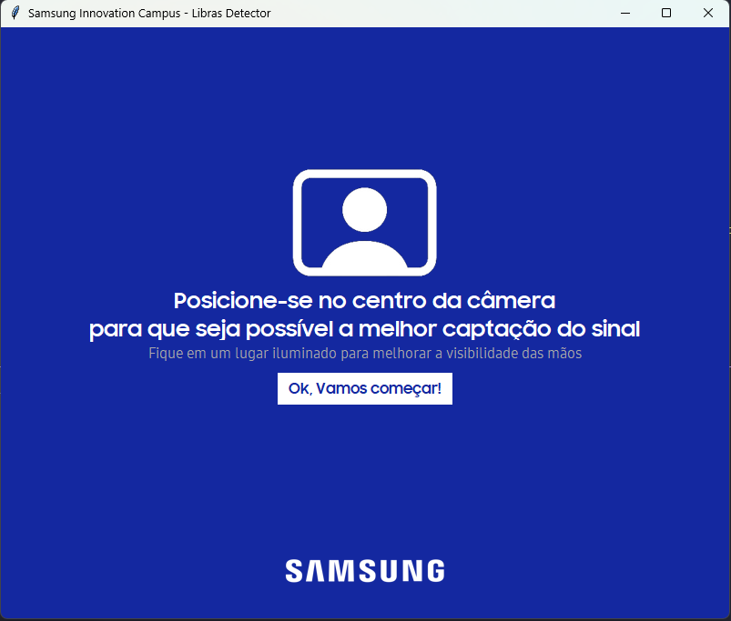

<h1>Libras Detector</h1>

  Uma ferramenta projetada para facilitar a comunicação diária de pessoas com deficiência auditiva,
  traduzindo instantaneamente os sinais da Língua Brasileira de Sinais para texto em português utilizando 
  a linguagem de programação Python e suas bibliotecas.

  

  <h2>Tecnologias utilizadas</h2>
  <ul>
    <li>
      Mediapipe
    </li>
    <li>
      Tkinter
    </li>
    <li>
      OpenCV
    </li>
    <li>
      Pillow
    </li>
    <li>
      Pyttsx3
    </li>
    <li>
      OpenAI
    </li>
  </ul>

  <h2>Como executar o projeto</h2>
  <ul style="list-style:none;">
    <li>
      
Clone este repositório em sua máquina local:

      <code>git clone https://github.com/Kato2004/link-base.git</code>
    </li>
    <li>
      
Navegue até o diretório do projeto

    </li>
    <li>
      
Instale as dependências

      <code>pip install -r requirements.txt</code>
    </li>
    <li>
      
Inicie a aplicação:

      <code>python main.py</code>
    </li>
  </ul>

